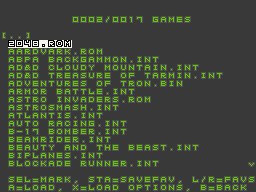
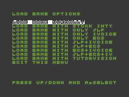
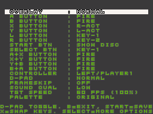
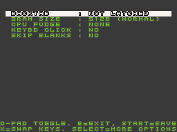
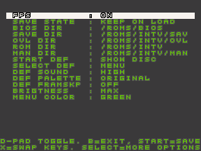
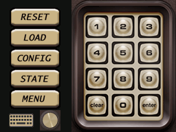
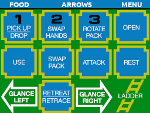
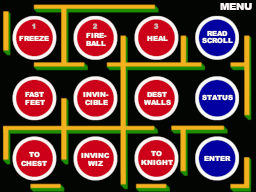

# NINTV-DS
NINTV-DS (aka Nintellivision) is an Intellivision console emulator running on the DS/DSi.

Install :
----------
To make this work, place NINTV-DS.NDS on your flashcart or SD card which you can launch.
You must supply the BIOS files:

* grom.bin
* exec.bin
* ivoice.bin (Optional for Intellivoice games)
* ecs.bin (Optional for ECS games)
* wbexec.bin (Optional for full Tutorvision mode)
* wbgrom.bin (Optional for full Tutorvision mode)

These can go in one of four places:  same directory as your ROMS, /roms/bios (recommended) or /roms/intv/bios or /data/bios (you can change the default location using the Global Configuration once you load the emulator).

The GROM and EXEC binaries are property of whomever currently holds the Intellivision rights and you will have to find and install them yourself.
Don't ask. If you own Intellivision Lives, you likely have both files already somewhere in your house. 

Features :
----------
 * All known games run at full speed, full framerate and with the best sound quality on a DSi or above  (the DSi has 2X the CPU and 4X the memory of the normal DS handhelds).
 * Almost every game runs at full speed on the older DS-LITE and DS-PHAT hardware with a slight reduction in sound quality.
 * Custom Overlay Support. See the 'extras' folder for details.
 * Manual/Instruction Support. See the 'extras' folder for an example.
 * Save Sate support (3 save slots per game).
 * High Scores for up to 10 scores per game with various sorting options.
 * Cheat / Hack support using NINTV-DS.cht (see 'extras' folder and place in /data directory)
 * Numerous button / controller mapping options. Dual-Controller support (run and shoot at the same time).
 * JLP support for accelerated functions (multiply/divide), extra RAM and flash memory. If not auto-detected, when loading a game use the X button to load with options.
 * ECS support for ECS games including sound-enhanced games like Space Patrol. If not auto-detected, when loading a game use the X button to load with options.
 * Tutorvision mode is supported which brings in the WBEXEC (REX) revised executive ROM as well as extra GRAM and main 16-bit RAM memory.
 * Extra 2K GRAM (aka half-Tutorvision mode) is supported on a per-game basis. Select 2K GRAM in the second page of Configuration for any game (reload game for it to take effect).

Technical Specs :
----------
 * Loads .ROM or .BIN/.CFG format files.
 * Up to 1024KB (512K words) of ROM memory emulated.
 * JLP 16-bit RAM emulated (8K Words) plus all accelerator functions supported.
 * JLP Flash support of 336 rows (42 sectors) for a total of 64K bytes (actual 64512 bytes). Each game gets their own 64K of file-backed flash.
 * ECS emulated with the 2K of 8-bit RAM, Keyboard, extra sound channels, etc.
 * Intellivoice emulated for games that take advantage of voice enhancements.
 * Up to 8K of extra 8-bit RAM emulated for games like USFC Chess and Land Battle (note, the 2K of ECS 8-bit RAM comes out of this pool).
 * Up to 24K Words of extra 16-bit RAM. With JLP enabled, the 8K of JLP RAM comes from this pool.
 * Paging on all segments of memory provided the full binary is 1024KB (bytes) or less.

Loading Games :
-----------------------
Most games you simply pick from the 'Load' list of roms and the game will load and play perfectly. In case it doesn't, you can load the game by pressing the X button (instead of the normal A button) and select from a list of possible hardware configurations (stock Intellivision, JLP, ECS and Intellivoice in all relevant combinations). Your last picked hardware setting will 'stick' and be saved for the game you are playing. 

Intellivision games come in two main formats: .bin+cfg and .rom formats. 

A flat-binary (.bin) may or may not have an associated .cfg file to help describe where to load it in memory. If no .cfg file is found, the Nintellivision internal database (with over 200 games known) will try to load it automatically.

Nintellivision emulator also supports the .int extension which can be either a .bin or a .rom format file. This is useful as Twilight Menu only supports auto-launching Nintellvision with .int files.

When loading games, you have the choice of just loading the game normally by pressing the A button which will try to determine the best 'machine' options to use for that game (e.g. Intellivoice, JLP, ECS, etc):

Or you can press the X button to launch the game with a selected machine type to override the best guess by the emulator:

This may be necessary if the game does not auto-detect the settings needed - for example, perhaps the game utilizes JLP Flash functionality or Intellivoice capabilities but the .rom or .bin/cfg does not specify those correctly, this is your way of overriding the machine type such that the game should run properly and with full capabilities.  Selecting any option here will save that at the default load option for this game in the future.  Selecting "Load Normally" will go back to the default behavior of trying to guess the best options to run.

Configuration Options :
-----------------------

There are three pages of configuration options! Two pages are for the game selected:

 

And the last page is for Global Options that apply to any new game you selct going forward (existing games that you've already overridden configuration options for will still retain those settings):

Controller Types :
-----------------------
* You can select Player 1 controller or Player 2 controller. 
* More importantly you can select 'Dual Action A' or 'Dual Action B'
* Dual Action A uses the disc/buttons from Controller 1 and the Keypad for Controller 2 (perfect for AD&D Cloudy Mountain or Tron Deadly Discs - you can use the NDS ABXY keys to fire arrows/discs)
* Dual Action B uses the disc from Controller 1 and the Buttons/Keypad for Controller 2 (perfect for Astrosmash, Buzz Bombers and any game you move and shoot)
* In configuration you can press the 'X' button to cycle through some common controller mappings or assign your own custom map.

Because the Intellivision had an innovative controller/keypad arrangement, you may want to get creative in how you map your buttons. For example, selecting Dual Action A controller and then mapping ABXY (and the related diagonals) to the 8-arrow-fire keypad buttons makes for a very enjoyable experience in games like AD&D Cloudy Mountain or Tron Deadly Discs. You move your adventurer with the d-pad and you fire with the ABXY into any of the 8 directions. Map the 'RUN' controller action button to the shoulder buttons on the DS and you can navigate any of Cloudy Mountain's dungeons with ease. In my opinion, for many of these games, this is pretty close to the original feel of playing on a real Intellivision. 

Overlays :
-----------------------
Nintellivision contains a default standard overlay that mimics a real Intellivision controller along with some common menu items. Each game can also have a custom overlay which is user-defined. 
A large number of custom overlays are provided in **extras.zip** in the overlay-library folder here on the github site. Nintellivision should automatically match up the game you are playing
with the correct overlay. If that doesn't happen, you can also name the .ovl file the same as the base filename of the ROM you are loading (e.g. if you have Astrosmash.int or Astrosmash.rom, 
you would name the overlay Astrosmash.ovl) - loading such a game would bring up the custom overlay automatically. If the custom overlay doesn't show, double check that the base filenames are 
exactly the same. By default, overlay files (.ovl) go into the same directory as the game ROMs but you can override this in Global Configuration.

  

Disc Overlay:
-----------------------
Built into the emulator is a full-disc overlay that maps to the 16-digital positions of a real Intellivision controller. It's not perfect - without the tactile feel of a real controller, it's not usable as a generic replacement for the D-Pad for smooth movement but it works great for games like Bowling or Golf where you need the discrete 16-digital position accuracy.  The DS START Button will toggle the disc overlay on/off (switching back to the normal overlay for the game).

Frameskip and Sound Quality :
-----------------------
The DSi will run all known games at full framerate without any frameskip needed and at the 'High' sound quality setting.  There is an 'Ultimate' sound quality that is slightly better than 'High' - it's marginally better but does take a significant amount of CPU time. Use it only for "simple" games (e.g. Astrosmash, Beauty and the Beast, etc.).

The DS-Lite/Phat will run many of the classic games without any frameskip but for most of the homebrews and later INTV games, frameskip is enabled and the sound quality is a bit lower. You can play with these settings as you like but generally it will still be a good playing experience even on older DS hardware.

Settings you should probably not touch :
-----------------------
* Backtab Latched is normally disabled. There are two known games (Stampede and Masters of the Universe) that need this to display properly. Most games do not change the backtab while the screen is rendering but to gain speed, these two games do just that. Setting this to TRUE chews up significant DS CPU time - but is a more accurate rendering.  If you encounter a future game where the images on screen appear to "jump" or "jitter" - try turing this to TRUE, Save your settings and reload the game.
* Fudge Timing is needed for the original version of Mattel Motocross which is running right at the edge of proper timing... some non NTSC systems had problems running that game back in the day. The cycle emulation on Nintellivision is pretty close but not perfect - so the fudge timing is used make it so Motocross runs properly. It's unlikely you would ever need to change this but I put it in to future-proof the emulator in there is another game discovered with borderline timing chartacteristics.
* Skip Blanks is needed for B-17 bomber as it should not blank the display when it's not active. The timing in Nintellivision is not perfect and without this set to TRUE, B-17 bomber will "flash" and it's a bit jarring. I don't know of any other games that need this setting but I've included it just in case.

Tutorvision Mode :
-----------------------
Late in the Intellivision life (1989), a joint venture to produce an updated Intellivision Console with a line of educational games was developed. This was known as the Tutorvision - it had some upgraded capabilities over a normal Intellivision. Unfortunately the project was scrapped and only a handful of Tutorvisions exist today. There were 16 educational games developed - of which only 2 (possibly 3) have been dumped. And there is one homebrew game (Little Man Computer) that uses the upgraded specifications.

To run in Tutorvision mode, you must select the X button when you select a game and pick the "RUN AS TUTORVISION". This setting will be saved (so you don't have to do that more than once). Running in Tutorvision mode requires the BIOS files wbexec.bin and wbgrom.bin which you can find with a bit of online searching (do not ask!). In Tutorvision mode, you get the following emulation changes:

* wbexec.bin replaces the normal exec.bin for enhanced executive ROM capabilities needed for Tutorvision games
* wbgrom.bin replaces the normal grom.bin for a slightly different font
* Automatically engages the 2K GRAM enhancement for improved graphics capabilities
* Adds addtional 16-bit System RAM from 0x360 to 0x4FF
* Identifies as a STIC 1A for purposes of auto-detection by some programs (such as FW Diagnostics)

Some games don't need Tutorvision Mode to run at their best - many of decle's offerings (Chippi-Plus and the Studio Vision games) only need the 2K GRAM expansion to look and play their best. You can enable the 2K GRAM expansion in the Configuration Options menu without the need for enabling the full Tutorvision mode.

Missing / Known Issues :
-----------------------
* ECS support is partial - there is no UART / Cassette handling but all other ECS features are present (page flipping, keyboard, extra 8-bit RAM and the extra PSG sound channels).
* Intellivision emulation is NTSC only - no PAL support.

License :
-----------------------
Copyright © 2021-2024 Dave Bernazzani (wavemotion-dave)

Copying and distribution of this emulator, its source code and associated 
readme files, with or without modification, are permitted in any medium without 
royalty provided the this copyright notice is used and wavemotion-dave (NINTV-DS)
and Kyle Davis (BLISS) are thanked profusely. 

The intro jingle is from Mixkit and is used courtesy of the Mixkit Stock Video Free License.

Sample Overlay graphics (other than the default generic keypad) are provided for personal use only
and do not fall under this license model - the original copyright holders of the images is retained.

The NINTV-DS emulator is offered as-is, without any warranty.

Credits :
---------
* BLISS - Intellivision Emulator. Originally developed by Kyle Davis. Contributions by Jesse Litton, Mike Dunston, Joseph Zbiciak.
* Most of the cheats are provided by the excellent work found at: http://www.midnightblueinternational.com/romhacks.php
* Thanks to Michael Hayes for allowing the inclusion of the cheats database into NINTV-DS
* Thanks to Stephen-J for help with many custom overlays.
* Thanks to Eisengrim, SeanD and ScottC for additional support for custom overlays.
* Thanks to ts-x for help with the Intellivision manuals and numerous custom overlays.
* And special thanks to Joseph Zbiciak (jzintv fame) for detailed descriptions of all the ins and outs of Intellivision hardware so that better emulation is possible!

--------------------------------------------------------------------------------
History :
--------------------------------------------------------------------------------
V5.7b : 20-Oct-2024 by wavemotion-dave
  * Fix for game selection to revert to the proper directory (the last one you were in to select games).
  * Fix for MOB collisions to not render for off-screen pixels which fixes the various Baseball Games (couldn't pick up ball in outfield).
  * Many new and improved overlays.

V5.7 : 12-Oct-2024 by wavemotion-dave
  * Fix to allow JLP games to execute out of 16-bit RAM. Fixes Defender of the Crown.
  * Fix ECS keyboard emulation to properly read back either port if configured for output (was causing FWDiagnostics to fail).
  * Improved UI display of 'JLP FLASH' so it shows a bit longer (but doesn't interfere with emulation speed)
  * Numerous new overlays added and updated some older ones.

V5.6 : 06-Oct-2024 by wavemotion-dave
  * Massive overhaul to the way overlays are found and loaded. No longer do you need to have the overlays named the same as the game ROM file - the emulator should find the matching overlay 99% of the time (and yes, you can still force the issue by naming the .ovl the same as the base game .int/.bin/.rom file)
  * If the system BIOS files are not found by name, a quick search is done by CRC32 to see if the emulator can load it.
  * These improvements should go a long way to helping people get their Nintellivision system running quickly and with less fuss.  
  
V5.5 : 23-Sep-2024 by wavemotion-dave
  * Improved ECS support with new full-screen ECS Keyboard and ability to switch between keypad controllers, disc and full keyboard.
  * Version 5.5a with hotfix for custom overlays

V5.4 : 10-Sep-2024 by wavemotion-dave
  * Full Tutorvision Mode supported. See Tutorvision section in this README for details.

V5.3 : 07-Sep-2024 by wavemotion-dave
  * Integrated 2KGRAM build into the main code. There is now one unified Nintellivision build. Use Configuration to select 2KGRAM (aka Half-Tutorvision mode) for games that support it.

V5.2 : 22-Jun-2024 by wavemotion-dave
  * Improved MOB collision detection to fix GORF
  * Improved MOB rendering so that Y coordinates of zero don't draw (fixes minor glitch in Beauty and the Beast at end of levels)
  * Improved JLP detection so we don't enable it inadvertently.

V5.1 : 28-May-2024 by wavemotion-dave
  * Improved STIC emulation to properly restrict MOBS for both GRAM and GROM to cards 0-63 in FG/BG mode.
  * Separate 2K GRAM build - experimental but functional. Use NINTV-DS-2KGRAM (will coexist with the normal NINTV-DS build)
  * Minor cleanup and tweaks as time permitted.
  
V5.0 : 06-Mar-2024 by wavemotion-dave
  * New splash screen jingle.
  * Boosted audio output by almost 25% so you don't have to max out your DS volume.
  * New audio ramp down/up to help soften (and partially eliminate) audio pops/clicks when transitioning in and out of a game to the menus.
  * Minor cleanup and tweaks as time permitted.
  * 5.0a with new Gold/Black menu buttons!
  
V4.9 : 01-Feb-2024 by wavemotion-dave
  * Improved cheat database selection - after selecting cheats, just press START to reset and apply cheats directly on the cheat picker screen.
  * Improved bankswitching/paged roms so that partially filled banks can be switched (some recent homebrews require this).
  * Updated internal database so more games load and run properly without tweaks.
  * Minor cleanups across the board as time permitted.
  
V4.8 : 24-Jan-2024 by wavemotion-dave
  * .int files are now auto-detected as either .bin(+cfg) or .rom files. This allows you to rename .rom files or .bin files to .int and let Twilight Menu++ auto-launch Nintellivision.
  * Slight improvement to the Intellivoice driver to give a minor boost in performance (mostly for DS-Lite/Phat).
  * Added new keyclick enable option in Configuration (page 2) that produces the typical Intellivision keyclick when you press the 12-button keypad (on the DS lower screen).
  * Added a new level of sound quality 'Ultimate'. The default for the DSi and above is still 'High' as 'Ultimate' consumes significant CPU time but you can enable it on a per-game basis for some of the more simple games (e.g. Astrosmash, Beauty and the Beast, AD&D Tarmin, etc)
  * DS-Lite now enables Intellivoice on World Series Major League Baseball - sound quality is a bit rough on the older handheld but very playalbe.
  * Fixed save/restore state including when backtab latched is TRUE (Stampede, Masters of the Universe)
  * Fix for intellivoice games so there are no more glitches on the updated version of Same Game and Robots.
  * Fix for ecs games so they don't inadvertantly write over the last graphics card in memory (causing minor graphics corruption on some games)
  * Correction of one intellivoice coefficient value (thanks to documentation in JZINTV) so voice games sound their best.
  * Other minor tweaks and cleanup as time permitted.

V4.7 : 19-Jan-2024 by wavemotion-dave
  * Major refactor of the audio processor for a big speedup in rendering especially with more than one audio processor (i.e. ECS or Intellivoice)
  * Switched from individual pixel output to 16-bit (two pixel) output when dealing with scrolling games (big speedup for games like Tron Solar Sailor, Space Spartans, Sorrow, TNT Cowboy, etc).
  * The DSi now defaults to NO frameskip on any game and the 'High' (best) sound quality.
  * Aggressive frameskip no longer an option - it's not needed for any game even on the older DS hardware.
  * The DS-Lite/Phat gets a 15% improvement in sound quality and many of the classic games now run without frameskip.
  * With the many updates, the config format changed and will be wiped back to defaults - sorry!

V4.6 : 15-Jan-2024 by wavemotion-dave
  * Massive overhaul to the core emulation to reduce memory footprint. The older DS-Lite/Phat (with 4MB of memory) can now load all of the newest homebrew games!
  * Optimizations in Video, Audio and CPU cores provides 10% speed up across the board.
  * Improved sound quality for the DSi including a new "BEST" option (not enabled by default) that will render the sound as good as I can make it on the handheld.
  * A few small fixes for the CPU core to improve the cycle accuracy.
  * With the improved speed, the DSi largely disables frameskip for the best visual experience.
  * Save States needed to be updated for all these changes - so your old save states can't be restored. Finish your current game before upgrading to 4.6!

V4.5 : 01-Jan-2024 by wavemotion-dave
  * Added new Screenshot handling (press and hold the L+R shoulder buttons for ~1 second to take a .bmp snapshot written to the SD card)
  * Added new meta key mapping to un-throttle (Speedup) the emulator. Useful for games where your character is resting and you want the emulator to run the frames as fast as it can.
  * Minor cleanup on the internal database for the latest and greatest homebrew games.
  * Lots of new and improved overlays in the extras.zip pack.

V4.4 : 30-Oct-2023 by wavemotion-dave
  * Major overhaul of configuration to provide for better future enhancements. Your old configurations will be wiped in favor of the new defaults. 
  * Major cleanup of overlay support - gone are the built-in overlays except for the normal Intellivision controller graphic and the mini-ECS keyboard. All other overlays are stored externally and a library of more than 40 custom overlays for personal use are provided.
  * Simplified use of custom overlays - if the .ovl file exists (with the same base name as the .ROM or .BIN file), it will automatically be loaded and used (you no longer need to specify that the overlay is 'Custom').
  * Other minor cleanups and tweaks as time permitted.

V4.3 : 24-Sep-2023 by wavemotion-dave
  * Improved 8-bit RAM support to provide a full 8K of 8-bit RAM (the ECS 2K of 8-bit RAM comes from this pool).
  * Added parsing of the .ROM enable/access table so that we properly allow for writable memory segments (allows the 'lilBro' games to work).
  * Other minor cleanups and tweaks as time permitted.

V4.2 : 15-Aug-2023 by wavemotion-dave
  * Improved JLP 16-bit RAM when it contends with similar 16-bit RAM specified in a config (.cfg) file (games like TNT Cowboy and A-F now run properly).
  * JLP Flash maximum increased to 64K per game.
  * Other minor cleanups and tweaks as time permitted.

V4.1 : 04-Jul-2023 by wavemotion-dave
  * Added the ability to map any DS key to the DISC UP and DISC DOWN which makes platform games like Rick Dynamite much more enjoyable.
  * Force load of JLP/ECS/IVoice will now save out to configuration for the game so you don't have to do that more than once.
  * Games of 16K or less without a specific .cfg or database entry will load at 5000h which is very likely where it wants to load.
  * Numerous homebrews and hacks added to the internal database.

V4.0 : 22-Apr-2023 by wavemotion-dave
  * Small optmizations across the board - utilizing every bit of the NDS instruction cache to squeeze out another frame or two of performance.

V3.9 : 05-Mar-2023 by wavemotion-dave
  * Improved ECS keyboard handling so we can handle 'transposed' scanning of columns/rows (allows demos like Adventure to run). 
  * Improved banking / page-flipping for faster page switches and more robust. There should be no more small audio 'gaps' when page-flipping music. 
  * For the DSi we now support 1024KB (512K Words) of binary ROM which is almost unfathomably large in the world of Intellivision games (130% larger than anything I'm aware of).

V3.8 : 26-Dec-2022 by wavemotion-dave
  * Improved memory handling so we don't run out of memory on the DS-Lite/Phat and no more crashes!
  * ECS and extra cart RAM now in faster VRAM to improve performance.
  * Fixed sound channels so that PSG + ECS + Intelivoice can all play nice together (mostly for World Series of Baseball)
  * Improved .ROM parsing support - now checking the CRC integrity and properly parsing the compatibility tags so more games run with the right settings (Intellivoice or JLP or ECS, etc).
  * New Game/Emulator Information screen to let you know if you are running in DS compatibility mode (less RAM, slower CPU) or DSi compatibilty mode (more RAM and faster CPU).
  * For the DSi or above we now support a much wider range of binary files (up to 512K) with page flipping.
  * New menu to allow you to launch a game with specific hardware configurations. Use X to load the game instead of A (launch instructions are on-screen).
  * Lots of small improvements and cleanup as time permitted.

V3.7a : 23-Dec-2022 by wavemotion-dave
  * First pass at ECS style page flipping (aka bankswap). DS-Lite will support World Series of Baseball without voice.
  * Improved error handling with better messages on-screen to help diagnose problems with missing roms, roms that are too big/complex, etc.
  * Cleanup across the board - reorganized memory to free up more resources for the future.
  
V3.6 : 24-May-2022 by wavemotion-dave
  * Added cheat support. Place NINTV-DS.cht into /data directory. See 'extras' folder.

V3.5 : 01-Mar-2022 by wavemotion-dave
  * Added support for ECS and ECS-Sound-Enhanced games.
  * Improved internal database so more games are recognized correctly.
  * Save states changed with ECS support. Finish your 3.4 games before upgrading or lose your progress.
  
V3.4 : 04-Dec-2021 by wavemotion-dave
  * Added support for more ROM segments so games like DK Jr Homebrew will run.
  * New global nintv-ds.man manual support - see extras folder.
  * Other small cleanups as time permitted.

V3.3 : 02-Dec-2021 by wavemotion-dave
  * Added use of generic.ovl which replaces the generic overlay if found.
  * Fix for custom overlay manual/instruction meta key.
  * Cleanups for .bin file reading and other small tweaks under the hood.
  * Code commented throughout for better maintainability.
  * More than 50 manuals added thanks to ts-x!  See extras folder.
  
V3.2 : 04-Nov-2021 by wavemotion-dave
  * Fixed .cfg file reading (last line was skipped if there was no CR)
  * A few homebrew and missing games added to the internal database.
  * A slight speedup on Intellivoice games which really helps the older DS hardware.
  
V3.1 : 30-Oct-2021 by wavemotion-dave
  * Favorites support - you can select up to 64 games as 'favs'
  * Sound sync when running faster than 60FPS
  * If BIOS files not found, emulator will search for them (slow but effective)
  * Tiny bit more speed and optimization

V3.0 : 25-Oct-2021 by wavemotion-dave
  * Sound fixed - no more zingers!
  * New global menu option for green vs white font.
  * New Agressive frameskip to help with older DS-LITE/PHAT play.
  * Many small cleanups and improvements under the hood.

V2.9 : 23-Oct-2021 by wavemotion-dave
  * Minor sound improvement across the board.
  * Significant speed improvement - games run 6-12% faster. DS-LITE will run more games.
  
V2.8 : 20-Oct-2021 by wavemotion-dave
  * First round of sound cleanup - two new improved settings in configuration.
  * Fixed crash with 'complex' custom overlay (out of memory) coming out of menu/config.
  
V2.7 : 19-Oct-2021 by wavemotion-dave
  * Fixed graphical glitches on D1K and D2K!
  * Proper fix for Q-Bert so it plays perfectly (no patch needed).
  * Fix for .man manuals sometimes missing last line.
  * Minor sound cleanup and other under-the-hood improvements for speed.

V2.6 : 18-Oct-2021 by wavemotion-dave
  * Added disc controller direction support to custom overlays. See Vectron.ovl in extras. 
  * Patched Q-Bert so it doesn't lose a life after each board.  
  * Fixed save states so we can save games with extra RAM (old save states will not work - sorry)

V2.5 : 15-Oct-2021 by wavemotion-dave
  * Horizontal Stretch/Offset now saved on a per-game basis.
  * Custom Palette support (see example in 'extras' folder).
  * Ability to map DS key to bring up manuals.
  * Added combo key mapping (AX, XY, YB, BA) for diagonal shooting.
  * Updated example .man manuals (see 'extras' folder).
  
V2.4 : 12-Oct-2021 by wavemotion-dave
  * Fixed horizontal and vertical offset/scrolling. Christmas Carol should now work.
  * Improved memory handling so we can load larger games.
  * Allow Manual/Instructions to be mapped to keys.
  * Improved generic overlay graphic.
  * Beta version of screen stretch/offset.  
  
V2.3 : 10-Oct-2021 by wavemotion-dave
  * New Custom Overlay Guide (see extras folder)
  * New Manual/Instructions Support (see extras folder)
  * Improved speed, reduced memory usage
  * Full JLP flash support
  * DS-LITE/PHAT sound improvment

V2.2 : 07-Oct-2021 by wavemotion-dave
  * Stampede graphics fixed.
  * Minor artifacts in Masters of the Universe fixed.
  * Centipede working again.
  * Improved speed across the board.
  
V2.1 : 03-Oct-2021 by wavemotion-dave
  * Nova Blast fixed.
  * JLP random fixed and improved JLP compatibility.
  * Reduced dynamic memory allocation.
  * Added headers and cleanup under the hood.

V2.0 : 02-Oct-2021 by wavemotion-dave
  * Improved loading from command line so overlays work again.
  * Improved first-load of a game so it's faster/smoother.
  * Added new SWAP handling to instantly swap left/right controller (for Swords & Serpents "co-op" play)
  * Patch for Q-Bert so lives are not lost (ever... it's not a great patch but makes the game playable)
  * Another frame or two of speedup.
  * Other cleanups under the hood.
  
V1.9 : 27-Sep-2021 by wavemotion-dave
  * Removed reliance on knowncarts.cfg. Internal database handles most games
    and you can use a "romname".cfg for new .bin games.
  * Added command line support so it can be called via TWL++.
  
V1.8 : 26-Sep-2021 by wavemotion-dave
  * Reworked configuration options - new game specific and global options available. 
    Unfortunatley your old config will be wiped out in favor of the new format. Sorry!
  * Improved sound quality for the DSi.

V1.7 : 24-Sep-2021 by wavemotion-dave
  * New Palette options.
  * New Brightness options.
  * New Save State options.
  * New MENU button for custom overlays (and START defaults to MENU now)
  * Other cleanup as time permitted.

V1.6 : 23-Sep-2021 by wavemotion-dave
  * Save State support added.
  * Fixed EVEN frameskip.
  
V1.5 : 21-Sep-2021 by wavemotion-dave
  * Better .ROM support (CVDEMO will now play)
  * More CP1610 optmization squeezing out a few more frames of performance.
  * Improved Frameskip and Speed options in Config area.
  * Cleanup for custom overlay support.
  * Other minor cleanups where time permitted.
  
V1.4 : 16-Sep-2021 by wavemotion-dave
  * Custom overlay support! See custom-overlay.zip in the distribution.
  * Hide bios files from game listing.
  * New d-pad configuration options.
  * Ability to map DS keys to meta-functions such as load, config, score, etc.
  * Other cleanups as time permitted... 

V1.3 : 12-Sep-2021 by wavemotion-dave
  * Basic JLP support for Accelerated functions and extra 16-bit RAM (hello Grail of the Gods!)
  * Major internal cleanup for better memory management. 
  * Squeezed out a couple more frames of speed improvement.

V1.2 : 10-Sep-2021 by wavemotion-dave
  * More speed - many games now playable full speed on the DS-LITE/PHAT!
  * On the DSi, even the Intellivoice games should be running full speed now.

V1.1 : 09-Sep-2021 by wavemotion-dave
  * Big boost in speed. Just about everything full speed on DSi. 
  * A few more overlays added.

V1.0 : 07-Sep-2021 by wavemotion-dave
  * First major release!

V0.9 : 06-Sep-2021 by wavemotion-dave
  * Major sound improvement (finally!)
  * High Score Support added
  
V0.8 : 05-Sep-2021 by wavemotion-dave
  * Two types of Dual-Action controllers supported (A=Standard, B=buttons on Controller #2)
  * More overlays added (Astrosmash, B-17 Bomber, Atlantis, Space Spartans)
  * Switched to a retro-green font for Game Select/Options
  * More new homebrews supported. 
  * Minor sound improvements.
  
V0.7 : 04-Sep-2021 by wavemotion-dave
  * Ability to save configuration on a per-game basis (START button in Config)
  * Minor sound improvements
  * Moved FPS and Turbo mode to Config
  * More homebrews added to "knowncarts.cfg"

V0.6 : 03-Sep-2021 by wavemotion-dave
  * More speedup and polish - especially for intellivoice games.
  * New config options for frameskip, sound quality
  * New overlays for MINOTAUR and ADVENTURE (in Config settings)
  * New dual-action controller support (in Config settings)
  * Can now map START and SELECT buttons

V0.5 : 02-Sep-2021 by wavemotion-dave
  * First pass release. 

